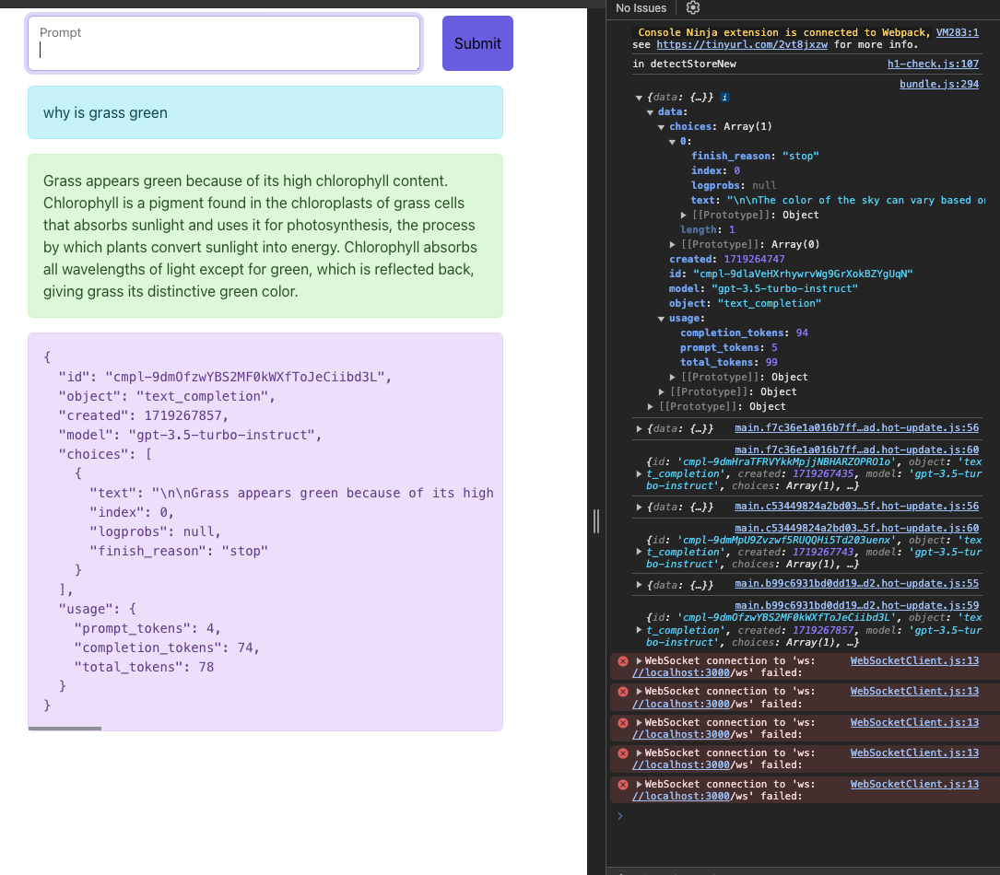

# AI-Powered Prompt Response Application
This project is an AI-powered web application that takes a user's prompt, processes it using OpenAI's GPT-3.5 model, and returns a response. The application also displays the raw JSON response from the API for debugging or informational purposes.

## Features
- **User Input**: The user can enter any prompt into the input field and submit it.
AI Response**: The application sends the user's prompt to OpenAI's GPT-3.5-turbo-instruct model and displays the response.
Raw JSON Output: The raw JSON response from the API is displayed for transparency and debugging purposes.
How It Works
- **User Prompt**: The user enters a prompt in the input field and clicks the "Submit" button.
- **API Request**: The application sends the prompt to the OpenAI API.
- **AI Processing**: The GPT-3.5-turbo-instruct model processes the prompt and generates a response.
- **Display Response**: The response is displayed in a user-friendly format as well as in raw JSON format.

## Screenshot 

##  Usage
Clone the repository:

sh
Copy code
git clone https://github.com/your-username/ai-prompt-response-app.git
cd ai-prompt-response-app
Install dependencies:

sh
Copy code
npm install
Create a .env file in the root directory and add your OpenAI API key:

makefile
Copy code
OPENAI_API_KEY=your_openai_api_key
Start the application:

sh
Copy code
npm start
Navigate to http://localhost:3000 in your web browser.

File Structure
src/: Contains the main application code.
components/: React components.
App.js: Main app component.
index.js: Entry point for the React application.
public/: Public assets and HTML template.
.env: Environment variables (not included in the repository).
Example
Prompt: The user enters "why is grass green" and clicks "Submit".
Response: The application displays:
User-friendly Response: "Grass appears green because of its high chlorophyll content..."
Raw JSON Response: The detailed JSON response from the OpenAI API.
Dependencies
React: JavaScript library for building user interfaces.
Axios: Promise-based HTTP client for the browser and Node.js.
OpenAI API: API for accessing OpenAI's language models.
Development
To contribute to the development of this project, follow these steps:

Fork the repository.
Create a new branch: git checkout -b my-new-feature
Commit your changes: git commit -am 'Add some feature'
Push to the branch: git push origin my-new-feature
Create a new Pull Request.
License
This project is licensed under the MIT License. See the LICENSE file for details.